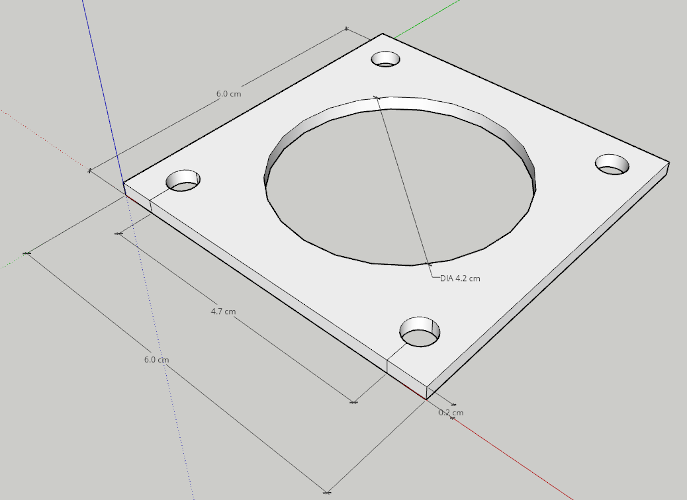

# StepperOnline&reg; PLE23-G20-D6 standoff plate with NEMA 23 Mount Points

3D Sketchup models for a standoff plate with NEMA 23 mount points for the StepperOnline&reg; PLE23-G20-D6.

## Isometric CAD


## Source Material

1. [StepperOnline&reg; PLE23-G20-D6 Website and Datasheet](https://www.omc-stepperonline.com/download/PLE23-G20-D6.pdf)

## Disclaimers

1. StepperOnline&reg; is a registered trademark of Omc Corporation Limited
2. [Sketchup](https://www.sketchup.com/) is a 3D modeling program owned by [Trimble&reg; Inc.](https://www.trimble.com/)
3. This work is not endorsed, funded, sponsored, or supported by StepperOnline&reg; or Trimble&reg;

## File Description

```txt
IRS-L515-H1-Mount
├── PLE23-G20-D6-StandoffPlate.skp        SketchUp file for L Bracket with L515 and 585006 mount points
├── PLE23-G20-D6-StandoffPlate.stl        STL file for L Bracket with L515 and 585006 mount points
├── README.md                           This document (a README)
```
